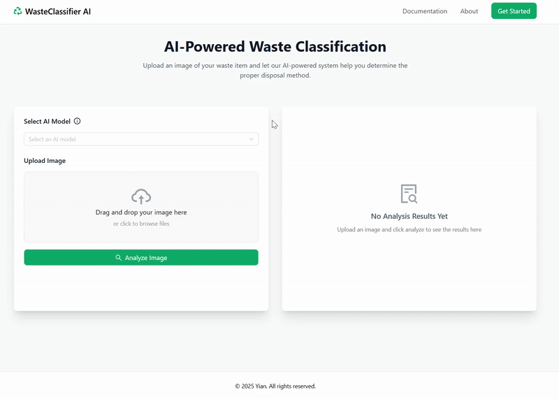

# **SmartBin: AI-Powered Waste Classification System**

SmartBin is an AI-powered waste classification system that leverages deep learning models to identify and categorize different types of waste. This project provides a RESTful API built with **FastAPI** and supports multiple state-of-the-art deep learning models for image classification.



## **🚀 Supported Deep Learning Models**
SmartBin supports the following deep learning models for waste classification:

- **DenseNet** - `densenet201`
- **EfficientNet** - `efficientnet_b7`
- **GoogLeNet** - `GoogLeNet`
- **LeNet** - `LeNet`
- **MobileNetV2** - `mobilenet_v2`
- **MobileNetV3** - `mobilenet_v3_large`
- **ResNet** - `resnet50`
- **AlexNet** - `AlexNet`
- **ShuffleNetV2** - `shufflenet_v2_x2_0`
- **VGG** - `vgg`
- **RegNet** - `regnet_x_32gf`

Each model processes an input image and predicts the most probable waste category. The models are optimized for both **GPU and CPU execution**, automatically detecting the available hardware.

---

## **🛠️ Deployment Guide**

### **Option 1: Deploy with Docker**

1. **Install Dependencies**
   - Ensure Docker and Docker Compose are installed on your system.
   - If using a GPU, install the **NVIDIA Container Toolkit**:
     ```sh
     sudo apt-get install -y nvidia-container-toolkit
     ```
2. **Clone the Repository**
   ```sh
   git clone https://github.com/AlanY1an/Smartbin
   cd smartbin
   ```
3. **Build and Run Containers**
   ```sh
   docker compose up --build -d
   ```
   This will:
   - Build the Docker images
   - Start the FastAPI backend
   - Start the frontend
   - Enable GPU acceleration if supported

4. **Verify Deployment**
   - Backend API: `http://127.0.0.1:8000/docs`
   - Frontend UI: `http://127.0.0.1:3000`

5. **Check GPU Availability (Optional)**
   ```sh
   docker exec -it <backend-container-id> nvidia-smi
   ```

6. **Stop and Remove Containers**
   ```sh
   docker compose down
   ```

---

### **Option 2: Run Locally (Without Docker)**

1. **Install Prerequisites**
   - **Python** (>= 3.8)
   - **Node.js** (>= 18)
   - **Git**

2. **Clone the Repository**
   ```sh
   git clone https://github.com/your-repo/smartbin.git
   cd smartbin
   ```

3. **Run the Backend**
   ```sh
   cd backend
   pip install -r requirements.txt
   uvicorn app:app --host 0.0.0.0 --port 8000 --reload
   ```
   - The API will be available at: `http://127.0.0.1:8000/docs`

4. **Run the Frontend**
   ```sh
   cd frontend
   npm install
   npm run dev
   ```
   - The frontend UI will be available at: `http://127.0.0.1:3000`

---

## **📜 API Documentation**
The project includes an interactive API documentation via **Swagger UI**:
- Open **[http://127.0.0.1:8000/docs](http://127.0.0.1:8000/docs)** in your browser.

---

## **📌 Future Enhancements**
- Support for real-time image classification via a mobile app
- Expansion of the dataset for improved model accuracy
- Integration with AWS for scalable deployment

---

## **📄 License**
This project is licensed under the **MIT License**. See `LICENSE` for details.